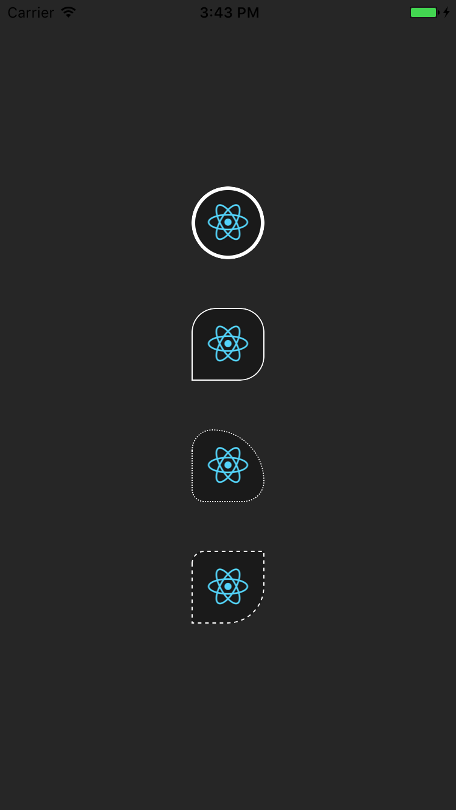

Just a wrapper to allow images to have various borderRadius for individual corners. It should be a drop-in replacement for the `<Image>`

~~~
      <BorderedImage style={styles.image} source={{ uri: 'https://facebook.github.io/react/img/logo_og.png' }} />
~~~





See [the demo](./demo/src/index.js) for examples.

Or preview it in [Expo](https://expo.io/@rborn/react-native-bordered-image-demo)


**Unsupported styles**

```
    'borderBottomColor',
    'borderBottomWidth',
    'borderLeftColor',
    'borderLeftWidth',
    'borderRightColor',
    'borderRightWidth',
    'borderTopColor',
    'borderTopWidth',
    'backgroundColor'
```


